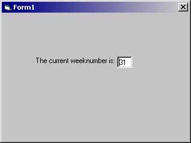



## Find the current weeknumber easy

### Description

This finds the current weeknumber easy.
 
### More Info
 

             |
---                |---
**Submitted On**   |
**By**             |[Dondata](https://github.com/Planet-Source-Code/PSCIndex/blob/master/ByAuthor/dondata.md)
**Level**          |Beginner
**User Rating**    |4.1 (33 globes from 8 users)
**Compatibility**  |VB 6\.0
**Category**       |[Coding Standards](https://github.com/Planet-Source-Code/PSCIndex/blob/master/ByCategory/coding-standards__1-43.md)
**World**          |[Visual Basic](https://github.com/Planet-Source-Code/PSCIndex/blob/master/ByWorld/visual-basic.md)
**Archive File**   |

### Source Code

MsgBox DatePart("ww", Date)

